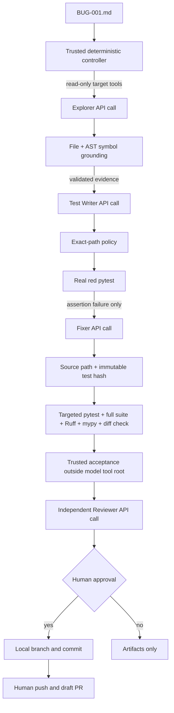

# API-driven multi-agent bug fixer

This repository is a small working prototype of a controlled engineering workflow:

```text
bug report → investigate → regression test → proven red test → minimal fix
→ deterministic verification → independent review → human approval → draft-PR branch
```

The application calls the OpenAI API directly through `openai-agents==0.22.0`. Codex was used
only to develop the repository; it is not part of the runtime. The target is a deliberately buggy
Python configuration service, so the demo can produce inspectable red-before/green-after evidence.

## What is real

- Explorer, Test Writer, Fixer, and Reviewer are separate API calls with isolated context.
- Repository inspection uses three real read-only function tools rooted at `demo_target/`.
- Candidate files are returned as strict Pydantic output; trusted Python code enforces paths and
  performs the writes.
- Tests, Ruff, mypy, Git, AST grounding, hashes, and acceptance checks run as real subprocesses.
- A detached worktree pins each run to an exact base SHA.
- Controller JSONL events and Agents SDK traces are generated by the live workflow.
- No model can merge, deploy, change CI, edit the verifier, or read an API key.

## Architecture



The controller owns routing. There are no handoffs, shared sessions, agent-as-tool calls, model
supervisors, unrestricted shell tools, or model-controlled gates.

## State machine

```text
START
→ CREATE_WORKTREE
→ EXPLORER
→ GROUNDING_GATE
→ TEST_WRITER
→ TEST_POLICY_GATE
→ RED_GATE
→ FIXER
→ FIX_POLICY_GATE
→ VERIFY
→ REVIEWER
→ HUMAN_GATE
→ PREPARED
→ END
```

Any failed non-retryable gate transitions to `FAILED`. The complete state is persisted atomically
in `artifacts/<run-id>/state.json` after meaningful transitions.

## Context management

| Role | Receives | Does not receive | Capabilities |
|---|---|---|---|
| Explorer | Issue, acceptance criteria, target repository view | Controller, verifier, secrets | Read-only target tools |
| Test Writer | Issue, criteria, validated Explorer output | Fixer context, verifier source, secrets | Read-only tools; returns one candidate test |
| Fixer | Issue, criteria, grounded evidence, exact red output, current resolver | Test-writing transcript, trusted oracle source, secrets | Read-only tools; returns one source candidate |
| Reviewer | Issue, criteria, diff, bounded exact red output, verifier report | Implementer transcripts, repository tools, secrets | Structured review only |

Each call starts without prior conversation state. Only strict structured output and bounded
mechanical evidence move between phases. Diagnostic retry payloads retain the relevant output tail,
not an ever-growing transcript. A run remains tied to `base_sha`; before creating a branch the
controller rejects a stale run if `main` moved.

## Validation and anti-hallucination

The validation stack is deliberately layered:

1. Pydantic models reject missing, mistyped, enum-invalid, and extra fields.
2. Explorer evidence paths are resolved inside `demo_target/`; referenced files must exist.
3. Referenced Python symbols must exist in the parsed AST.
4. Test Writer can create only `demo_target/tests/test_bug001_regression.py`.
5. Candidate Python must parse, contain the required symbol, use only role-specific imports, and
   avoid dangerous built-ins and dunder access before any candidate code executes.
6. The red gate accepts pytest exit code 1 only when output contains an assertion failure and no
   syntax, import, or collection error.
7. The test hash is recorded before Fixer and checked afterward.
8. Fixer can change only `demo_target/src/config_service/resolver.py`.
9. Final changed files must be exactly the new regression test and the resolver.
10. Git intent-to-add makes the new untracked test visible to `git diff --check`.
11. Targeted pytest, the full target suite, Ruff, mypy, and `git diff --check` must all pass.
12. A trusted acceptance process checks defaults, `None`, explicit `0`, explicit `False`, and
    ordinary truthy overrides through the public entry point.
13. The independent Reviewer can reject but cannot override a failed deterministic check.
14. A human decides whether a local draft-PR branch may be prepared.

Green tests prove correctness only relative to their oracle. The external acceptance layer and
missed-case eval exist because a plausible test can still be incomplete.

## Failure handling and idempotency

| Failure | Controller behavior |
|---|---|
| Invalid structured output | One retry with the validation class; otherwise stop |
| Temporary model timeout | One diagnostic retry |
| Hallucinated Explorer reference | One fresh Explorer call with grounding evidence |
| Test does not reproduce by assertion | Remove the candidate and retry Test Writer once |
| Final semantic verification fails | Restore original source and retry Fixer once |
| Path change, deletion, test mutation | Immediate stop; no retry |
| Reviewer rejection | Stop and escalate to the human |
| Stale base SHA | Stop before branch creation |
| Agent reaches its role-specific turn cap | Stop and retain the failed trace and usage metrics |

There are at most six model calls in one run. Unique run IDs, detached worktrees, unique branch
names, exact file allowlists, and stale-base checks prevent a blind rerun from overwriting a prior
result or creating an inconsistent branch.

Each call also has a bounded Agents SDK loop budget: Explorer 12 turns, Test Writer 8, Fixer 6,
and Reviewer 2. A turn is an execution step that may include a model response and tool use; it is
not a dollar or token allowance. Raising a ceiling does not pre-spend it. Explorer gets the largest
ceiling because it must navigate source with read-only tools, while the tool-free Reviewer normally
finishes in one turn. Successful and failed calls both contribute their available token and latency
usage to `metrics.json`.

## Controlled failure demonstration

`--inject-invalid-explorer` performs a clearly labelled fault injection after a real Explorer call:
the original output is saved unchanged, while a copy changes `evidence` from a list to a string.
The schema gate rejects the copy, records `SCHEMA_ERROR`, proves that Test Writer was not started,
and makes one new Explorer call with the exact validation error.

This is not presented as a spontaneous model hallucination.

## Missed-case eval and self-improvement

The deterministic eval applies a deliberately partial fix that preserves `False` but still loses
`0`, then adds a weak test that covers only `False`:

```text
verifier v0: weak test + public tests + Ruff + mypy + diff check → incorrectly ACCEPTED
verifier v1: all v0 checks + trusted explicit-zero acceptance → correctly REJECTED
```

This gives a permanent regression case for an observed weakness in the validation policy. Run it
with `python -m bugfixer.evals.missed_case --repo .`.

## Repository layout

```text
bugfixer/                 trusted controller and API application
  acceptance/             trusted oracle outside the model-visible root
  evals/                  controlled verifier regression case
  prompts/                version-controlled role instructions
demo_target/              only repository subtree visible through model tools
  issues/BUG-001.md
  src/config_service/
  tests/
artifacts/<run-id>/       ignored runtime evidence
tests/                    controller and policy tests; no live API calls
.github/workflows/        pull-request-only checks
docs/                     recording and submission material
```

## Setup on Windows

Python 3.11 is the reference environment.

```powershell
py -3.11 -m venv .venv
.venv\Scripts\Activate.ps1
python -m pip install --upgrade pip
python -m pip install -e .
```

No API key is required for imports or local tests.

## Local checks on the intentionally buggy `main`

```powershell
python -m pytest tests -q
python -m pytest demo_target/tests -q
python -m ruff check .
python -m mypy bugfixer demo_target/src
python demo_target/scripts/reproduce_bug.py
```

The first four commands pass. The reproducer intentionally exits 1 on `main` because the public
tests do not cover explicit falsy values yet.

## Safe API setup

Never paste a key into chat, source, artifacts, shell history, or the recording. In a fresh
PowerShell 7 window, before recording:

```powershell
$env:OPENAI_API_KEY = Read-Host "Paste OPENAI_API_KEY" -MaskInput
$env:BUGFIXER_MODEL = "gpt-5.6-terra"
$env:OPENAI_AGENTS_TRACE_INCLUDE_SENSITIVE_DATA = "false"
python -c "import os; print('API key configured:', bool(os.getenv('OPENAI_API_KEY')))"
```

The controller never returns or logs the key, and target subprocesses receive an environment with
API, GitHub, database, and common cloud credential variables removed.

## Low-cost smoke test

```powershell
python -m bugfixer.smoke_api
```

This makes one short, tool-free structured call with a 200-token output cap.

## Live end-to-end run

Start only from a clean `main` checkout:

```powershell
python -m bugfixer.cli `
  --repo . `
  --target-dir demo_target `
  --issue demo_target/issues/BUG-001.md `
  --keep-worktree
```

After the Reviewer approves, inspect `decision-package.md`, then enter `y` only if the evidence is
acceptable. The controller creates a local `agent/BUG-001-<run-suffix>` branch and one commit. It
does not push or call GitHub.

For the controlled schema failure:

```powershell
python -m bugfixer.cli `
  --repo . `
  --target-dir demo_target `
  --issue demo_target/issues/BUG-001.md `
  --inject-invalid-explorer `
  --keep-worktree
```

## Artifacts

```text
artifacts/<run-id>/
├── state.json
├── controller.trace.jsonl
├── metrics.json
├── diff.patch
├── decision-package.md
├── pr-body.md
├── prompts/
├── agents/
└── verification/
    ├── test-before.txt
    ├── targeted-after.txt
    ├── full-suite.txt
    ├── ruff.txt
    ├── mypy.txt
    ├── diff-check.txt
    └── trusted-acceptance.txt
```

The JSONL trace records only real controller events. It does not invent model/tool spans or save
hidden reasoning. The Agents SDK emits its own trace for model and function-tool activity.

## Publishing the draft PR

The retained worktree and branch are printed at the end of a successful run:

```powershell
git -C "<WORKTREE_PATH>" status
git -C "<WORKTREE_PATH>" log --oneline -3
git -C "<WORKTREE_PATH>" push -u origin "<BRANCH_NAME>"
```

Create a **draft** pull request in GitHub using `artifacts/<run-id>/pr-body.md`. Do not merge before
recording the demo.

## Production operation and monitoring

The recommended first production mode is semi-automatic:

```text
GitHub Issue / Jira / Sentry
→ human applies autofix-approved label
→ webhook and durable queue
→ one ephemeral sandbox per job
→ this controller profile
→ automatic draft PR
→ human review and normal CI/CD
```

Production requires a GitHub App, secret manager, durable state, idempotency keys, concurrency and
token budgets, repository allowlists, prompt-injection controls, sandbox cleanup, alerts, and
operational dashboards.

Track input/cached/output tokens, latency, retry rate, schema and grounding failures, verifier
failures, Reviewer rejections, and human rejection. The early degradation signal is **first-pass
trusted-acceptance success on a fixed canary set**. Retry rate alone is insufficient because a
system can avoid retries while producing confidently wrong patches.

## Deliberately rejected alternatives

| Alternative | Reason rejected for this prototype |
|---|---|
| One LLM supervisor | The model would influence whether its own work passes gates |
| Direct file-write or shell tool | Excessive authority and weak path control |
| Handoffs/shared session | Unnecessary context coupling and transcript leakage |
| LangGraph or another orchestration framework | The short linear state machine is clearer in Python |
| Docker, database, and queue | Operationally useful later, unnecessary for a local proof |
| Automatic merge/deploy | Irreversible risk belongs behind existing human and CI/CD controls |

## Limitations

This is not a universal or production-ready bug fixer. Its current project adapter supports one
Python project using Git, pytest, Ruff, and mypy. A different stack needs a profile defining setup,
test, lint, type-check, build, allowed paths, forbidden paths, timeouts, and a domain-specific
trusted oracle. The same investigate → reproduce → patch → verify → review → draft-PR pattern can
remain unchanged. The local prototype narrows candidate code with AST policy and strips secrets
from subprocess environments, but it is not an OS security sandbox; production must execute
untrusted candidates inside disposable containers or stronger isolated workers with restricted
filesystem and network access.
